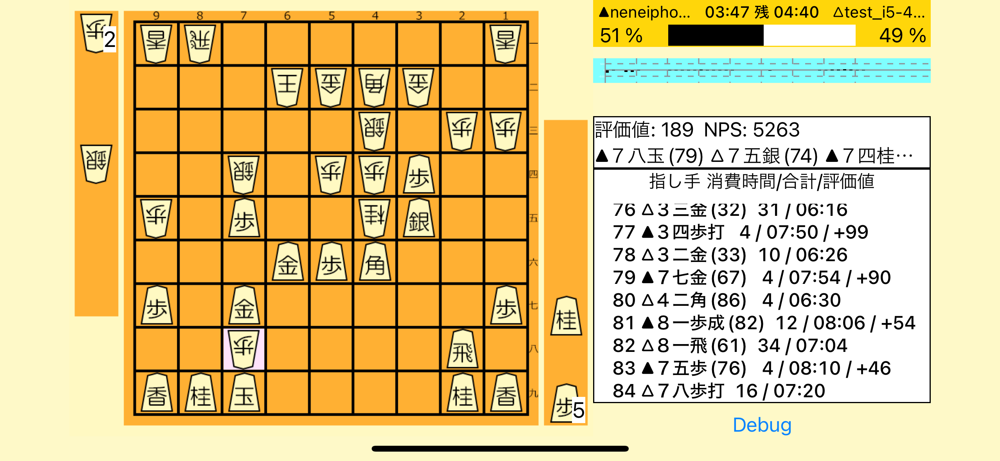

#  ねね将棋Swift

iPad / iPhone向け将棋AIの試作品です。TCPを介したUSI/CSAプロトコルで通信対局する専用で、人間との対局機能未実装。将棋AI専門家向け。第32回世界コンピュータ将棋選手権(2022年5月)出場。二次予選にシードとして出場し、28チーム中27位。



深層学習モデルをAppleの機械学習専用チップであるNeural Engine上で動作させる点が特徴。iPad(第9世代)を用いた場合思考時間1手約10秒で、floodgateレート3300程度。概ね人間のプロ並みの強さ。

App Storeでは配布していません。各自でMac上のXcodeでビルドすることが必要です。iPad(第9世代)向けの画面レイアウトとなっています。iPhoneでもロジックは動くもののUIが画面内に収まらないので実質使えません。

# メモ
## floodgateへの接続

起動直後の画面で、"CSA client mode"の下のフォームを以下のように設定

- Config name
  - 設定を保存する際の名前。何でもよい
- IP
  - `wdoor.c.u-tokyo.ac.jp`
- Port
  - 4081
- Reconnect
  - 連続対局する場合はon
- Login name
  - 任意の文字列(アルファベット、数字、アンダースコア)
- Login password
  - `floodgate-300-10F,xxx` xxxの部分は、何かしらランダムなアルファベットを入れる(trip)
- Show password
  - ログインパスワードを伏字にするかどうか
- Ponder
  - 相手番の時に思考するか
- Total time
  - `300.0` 初期持ち時間（秒）
- Increment time
  - `10.0` フィッシャールールでの1手当たりの加算時間（秒）

Saveをタップすると端末内に接続設定を保存できる。次回起動以降、Saveの下に、保存した設定を選ぶボタンがある。

Start CSAでfloodgateに接続する。毎時0,30分に対局開始。

終了したい場合はアプリを終了させる。ホームボタンをダブルタップして、アプリのサムネイルを上にスワイプする。

## 選手権サーバへの接続

起動直後の画面で、"CSA client mode"の下のフォームを以下のように設定

- Config name
  - 設定を保存する際の名前。何でもよい
- IP
  - `gserver.computer-shogi.org`
- Port
  - 4081
- Reconnect
  - off
- Login name
  - 申し込み時に指定した名前
- Login password
  - 申し込み時に指定したパスワード
- Show password
  - ログインパスワードを伏字にするかどうか
- Ponder
  - 相手番の時に思考するか
- Total time
  - `900.0` 初期持ち時間（秒）
- Increment time
  - `5.0` フィッシャールールでの1手当たりの加算時間（秒）

Saveをタップすると端末内に接続設定を保存できる。次回起動以降、Saveの下に、保存した設定を選ぶボタンがある。

Start CSAで選手権サーバに接続する。サーバ側で手動でマッチメイクされたら対局開始。

終了したい場合はアプリを終了させる。ホームボタンをダブルタップして、アプリのサムネイルを上にスワイプする。別の対局を始める場合もいったん終了して最初からやり直す。

## テストケースデータの解凍
巨大なテキストファイルがあるため、解凍が必要

```
cd NeneShogiSwift
gunzip -k PositionTestCase.txt.gz
```

## 合法手生成テストデータの作成

`NeneShogiSwift/PositionTestCase.txt`に置くことでビルド時にアプリに取り込まれる

過去のねね将棋用に（やねうら王を用いて）作ったテストケースデータを変換して使う

注意: 連続王手の千日手は考慮してない。千日手、入玉宣言の可否も含めたテストが今後必要

ファイルを取得しPythonで1行=1局面のファイルを作成 https://github.com/select766/neneshogi/blob/master/data/testcase/generate_position_testcase.pickle.yaml

```
import yaml
import json
cases = yaml.safe_load(open("path/to/generate_position_testcase.pickle.yaml"))
with open("NeneShogiSwift/PositionTestCase.txt", "w") as f:
    for case in cases:
        f.write(json.dumps({"sfen": case["sfen"], "legalMoves": case["legal_moves"], "positionCommand": case["position_command"], "inCheck": case["in_check"]}) + "\n")
```

## ログの取り出し
iPadをMacに接続した状態で以下のコマンドを実行する

```
sudo log collect --device --last 1d
```

ねね将棋のログを抽出して標準出力に表示

```
log show --archive system_logs.logarchive --predicate '(subsystem IN {"jp.outlook.select766.NeneShogiSwift"})' --last 1d
```

## USIモード

USIプロトコルを直接TCPに載せるデバッグ用モード。

Macで以下のシェルスクリプト (`port8090.sh`)を作成

```bash
#!/bin/sh
nc -l 8090
```

```
chmod +x port8090.sh
```

iOSシミュレータでアプリを起動。

将棋所Macで、シェルスクリプトをエンジンとして登録（待機状態になる）。

アプリで"Start USI"をタップすると接続され、エンジン登録が完了する。

以降、対局で使える。Mac側で対局開始操作をしてから、iOS側で接続操作をする。一度接続が終了したら、アプリを再起動する必要がある。

# ライセンス

やねうら王に従いGPLv3とします。

`user_book1.db` はやねうら王プロジェクトの100テラショック定跡です。
